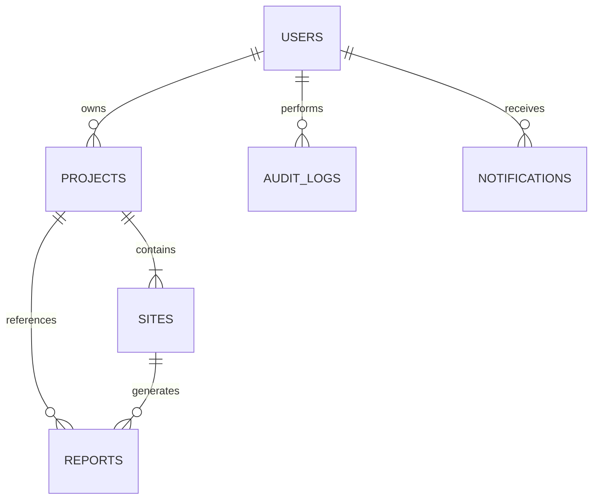

# Database Documentation - GeoEnergy AI Platform

This document describes the schema architecture, relationships, constraints, indexes, and tables of the **GeoEnergy AI – Smart Renewable Energy Intelligence Platform** database.

---

## 1. Entity Relationship (ER) Diagram

---

## 2. Table Specifications

### `users` Table
- **Primary Key**: `id` (Integer)
- **Columns**:
  - `username` (String, Unique, Indexed)
  - `email` (String, Unique, Indexed)
  - `hashed_password` (String)
  - `full_name` (String, Nullable)
  - `role` (String, Default: "planner")
  - `is_active` (Boolean, Default: true)
  - `is_onboarded` (Boolean, Default: false)
  - `created_at` (DateTime, Default: UTC)

### `projects` Table
- **Primary Key**: `id` (Integer)
- **Foreign Keys**:
  - `owner_id` -> `users.id` (Indexed)
  - `assigned_analyst_id` -> `users.id` (Indexed, Nullable)
  - `assigned_manager_id` -> `users.id` (Indexed, Nullable)
- **Columns**:
  - `name` (String, Indexed)
  - `description` (String, Nullable)
  - `renewable_type` (String, Default: "solar")
  - `status` (String, Default: "Draft")
  - `milestones` (String/JSON-text)
  - `completion_percentage` (Integer, Default: 0)
  - `is_archived` (Boolean, Default: false)

### `sites` Table
- **Primary Key**: `id` (Integer)
- **Foreign Key**:
  - `project_id` -> `projects.id` (Indexed)
- **Columns**:
  - `name` (String)
  - `latitude` (Float, Indexed)
  - `longitude` (Float, Indexed)
  - `region` (String, Nullable)
  - `land_area` (Float, Nullable)
  - `elevation` (Float, Nullable)
  - `land_ownership` (String, Nullable)
  - `details_json` (String/JSON-text, Nullable)

### `notifications` Table
- **Primary Key**: `id` (Integer)
- **Foreign Key**:
  - `user_id` -> `users.id` (Indexed, Nullable)
  - `project_id` -> `projects.id` (Indexed, Nullable)
- **Columns**:
  - `sender` (String, Default: "system")
  - `message` (String)
  - `is_read` (Boolean, Default: false)
  - `created_at` (DateTime)

### `audit_logs` Table
- **Primary Key**: `id` (Integer)
- **Columns**:
  - `event` (String)
  - `user_email` (String, Indexed)
  - `ip_address` (String)
  - `role` (String, Nullable)
  - `action` (String, Nullable)
  - `project_name` (String, Nullable)
  - `status` (String)
  - `created_at` (DateTime, Indexed)
