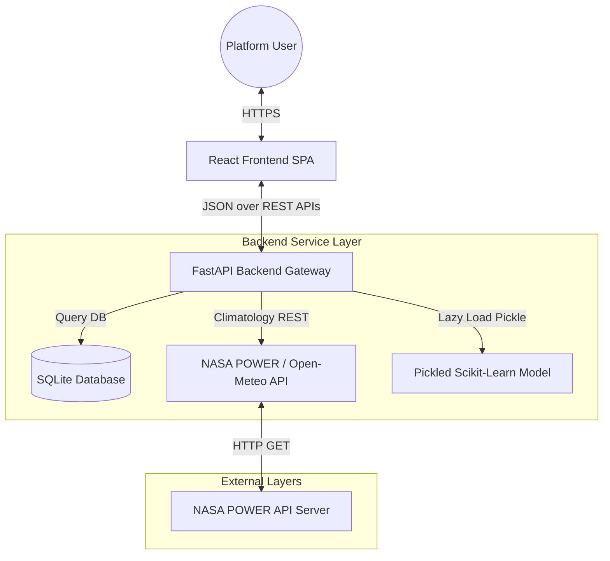

# Project Architecture - GeoEnergy AI Platform

This document describes the high-level architecture, component communication patterns, deployment topology, and folder structures of the **GeoEnergy AI – Smart Renewable Energy Intelligence Platform**.

---

## 1. System Architecture

The platform utilizes a decoupled, client-server Architecture pattern, separating the presentation layer (React SPA) from the application and domain logic (FastAPI + Python Analytical Services).



---

## 2. Frontend Architecture (React)

The frontend is a lightweight Single Page Application (SPA) compiled using Vite:
- **State Management**: React state hooks (`useState`, `useEffect`) manage user sessions, coordinates selection, and live reports telemetry.
- **Routing**: Client-side state routing (`currentView` + URL state push history) ensures zero-refresh screen changes.
- **Mapping Leaflet**: Rendered via standard Leaflet Leaflet overlays, enabling precise map-clicks.
- **Charts Engine**: Recharts graphics are used to plot 20-year financial forecasts.

---

## 3. Backend Architecture (FastAPI)

The backend is built as an asynchronous Python REST API:
- **FastAPI Gateway**: Serves as the main gateway handling input validation, JWT claims validation, and CORS middleware headers.
- **Role-Based Guards**: Dependencies (`RoleChecker`, `PermissionChecker`) evaluate user roles against the route matrix.
- **Database Engine**: SQLAlchemy acts as the ORM, mapping database model queries to SQLite.

---

## 4. Machine Learning Architecture

- **Estimator Model**: A Scikit-Learn Random Forest/Gradient Boosting Classifier.
- **Lazy Loading Model**: Pre-trained model weights are serialized as `model.pkl`. On startup or first prediction, the model is lazy-loaded, avoiding redundant retraining and returning suitability predictions in `<1ms`.

---

## 5. Deployment Architecture

Containerized using Docker and Orchestrated via Docker Compose:
- **Nginx Web Server**: Serves frontend static builds and proxies `/api` endpoints to the backend container.
- **Backend Service**: Runs the FastAPI app via Uvicorn.
- **Data Volume Bindings**: Persists SQLite database updates on host machines.

---

## 6. Folder Structure

```text
solar-wind-platform/
│
├── backend/
│   ├── app/
│   │   ├── ml/
│   │   │   └── model.pkl          # Serialized ML suitability estimator
│   │   │
│   │   ├── auth.py                # User login, JWT token generators, Google OAuth
│   │   ├── database.py            # ORM session configuration & seed data
│   │   ├── engine_environmental.py # Coordinates caching & weather fallbacks
│   │   ├── engine_ml.py           # Model loading and predictions
│   │   ├── models.py              # SQLAlchemy schemas
│   │   ├── reports.py             # Excel & CSV generation tools
│   │   └── main.py                # FastAPI endpoints & middleware
│   │
│   ├── Dockerfile                 # Backend container definition
│   └── requirements.txt           # Python packages
│
├── frontend/
│   ├── src/
│   │   ├── components/            # Interactive maps and charts components
│   │   ├── views/                 # Dashboards (Planner, GIS, PM, Admin)
│   │   └── App.jsx                # Router & central state synchronization
│   │
│   ├── Dockerfile                 # Frontend multi-stage container
│   └── nginx.conf                 # SPA routing proxy server config
│
└── docker-compose.yml             # Service orchestra composition
```
