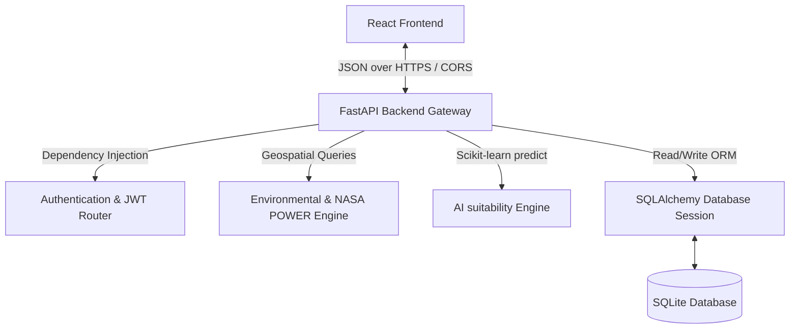

<<<<<<< HEAD
# GeoEnergy AI - Solar & Wind Deployment Intelligence Platform

**GeoEnergy AI** is a comprehensive geospatial AI planning and resource suitability forecasting application designed for the deployment of solar, wind, and hybrid clean energy systems. Using **Smart Renewable Energy Intelligence**, this platform enables renewable energy planners, GIS analysts, project managers, and administrators to locate, analyze, score, and optimize clean energy sites globally.
=======
# GeoEnergy AI – Solar & Wind Deployment Intelligence Platform

A state-of-the-art geospatial planning, resource forecasting, and AI-powered decision intelligence application designed for the deployment of solar, wind, and hybrid clean energy systems. This enterprise-ready platform enables planners, GIS analysts, project managers, and administrators to evaluate, analyze, track, and optimize renewable energy sites globally.

---

## 📂 Table of Contents
1. [Objectives](#-objectives)
2. [Tech Stack](#-tech-stack)
3. [Folder Structure](#-folder-structure)
4. [Installation & Setup](#-installation--setup)
5. [User Roles & Default Credentials](#-user-roles--default-credentials)
6. [Feature List](#-feature-list)
7. [API List](#-api-list)
8. [Database Schema Summary](#-database-schema-summary)
9. [Project Architecture Summary](#-project-architecture-summary)
10. [Milestone Completion Report](#-milestone-completion-report)
11. [Mentor Presentation Notes](#-mentor-presentation-notes)
12. [Resume Project Description](#-resume-project-description)
13. [Future Scope (Milestone 4 suggestions)](#-future-scope-milestone-4-suggestions)
>>>>>>> 11727c4 (Complete Milestone 3 implementation)

---

## 📋 Objectives
*   **Production Authentication**: Secure standard user registry alongside official Google OAuth 2.0 verification.
*   **Geospatial Intelligence**: Capture coordinates directly from an interactive GIS Map and integrate NASA POWER point climatology.
*   **Machine Learning Predictors**: Execute trained models for solar output, wind potential, and hybrid siting recommendations.
*   **Workflow Coordination**: Progress projects through strict lifecycle states (Draft -> Submitted -> GIS Review -> Env Review -> PM Review -> Admin Approval -> Construction -> Completed) with role-based checks.
*   **Compliance & Logging**: Trace planner activities via an immutable system audit log and enforce rate limits.

---

## ⚡ Tech Stack

### Frontend (React + Vite)
*   **Vite & React**: Fast Single Page Application compiler and structure.
*   **@react-oauth/google**: Standard SDK for Google Sign-In and token verification.
*   **Leaflet & OpenStreetMap**: Interactive geospatial mapping.
*   **Recharts**: Vector graphics for Payback Forecasts and State capacities.
*   **Lucide React**: Premium dark-theme iconography.
*   **Tailwind CSS**: Sleek glassmorphism and modern layouts.

### Backend (FastAPI)
*   **FastAPI**: Asynchronous Python API framework.
*   **google-auth & requests**: Official SDK for Google ID Token verification.
*   **PyJWT & Bcrypt**: JWT secure session validation and bcrypt password hashing.
*   **SQLAlchemy**: SQLite Database ORM and persistent storage.
*   **Scikit-Learn & Pickle**: Trained ML estimators for resource assessment and prediction scoring.
*   **HTTPX**: Asynchronous HTTP client forNASA POWER API climatology.

---

## 📂 Folder Structure

```text
solar-wind-platform/
│
├── backend/
│   ├── app/
│   │   ├── ml/
│   │   │   ├── model.pkl          # Pickled Scikit-Learn suitability scoring model
│   │   │   └── engine_ml.py       # ML persistence and prediction loader
│   │   ├── config.py              # Loads .env configurations
│   │   ├── database.py            # SQLite session, auto-migrations & default user seeding
│   │   ├── models.py              # SQLAlchemy schemas and Pydantic validators
│   │   ├── auth.py                # JWT authentication & Google Login v2 controllers
│   │   ├── engine_environmental.py # Geospatial constraints checks & NASA POWER API
│   │   ├── engine_solar.py         # PV GHI electricity output engine
│   │   ├── engine_wind.py          # Turbine capacity factor engine
│   │   ├── engine_suitability.py   # Multi-variable suitability ranking matrix
│   │   ├── engine_optimization.py  # CAPEX/OPEX sizing and phased expansion guides
│   │   ├── notifications.py       # Siting lifecycle alerts compiler
│   │   ├── reports.py             # NPV/IRR Excel CSV export services
│   │   └── main.py                # FastAPI routes, rate limiter, and audit logs
│   │
│   ├── .env                       # Backend secrets (DATABASE_URL, SECRET_KEY, GOOGLE_CLIENT_ID)
│   ├── .env.example               # Template for backend credentials
│   ├── solar_wind.db              # SQLite Database
│   └── requirements.txt           # Python packages
│
├── frontend/
│   ├── src/
│   │   ├── components/            # Reusable UI (MapView, AnalyticsCharts, Sidebar)
│   │   ├── views/                 # Dashboards (Planner, GIS, Manager, Admin, Login, Profile)
│   │   ├── App.jsx                # Router, user context, and central sync state
│   │   ├── main.jsx               # React DOM Entrypoint & GoogleOAuthProvider wrapping
│   │   └── index.css              # CSS style tokens and glassmorphism definitions
│   │
│   ├── .env                       # Frontend config (VITE_API_BASE_URL, VITE_GOOGLE_CLIENT_ID)
│   ├── .env.example               # Template for frontend variables
│   ├── package.json               # Node packages
│   └── vite.config.js             # Vite configuration with API Proxy mapping
│
├── .gitignore                     # Git tracking exclusions
└── README.md                      # Documentation
```

---

## ⚙️ Installation & Setup

### Prerequisites
*   **Python**: 3.10 or higher
*   **Node.js**: 18.0 or higher

### 1. Backend Setup (FastAPI)
1.  Navigate to the backend directory:
    ```bash
    cd backend
    ```
2.  Create and activate a virtual environment:
    ```bash
    python -m venv venv
    # On Windows:
    .\venv\Scripts\activate
    # On Linux/macOS:
    source venv/bin/activate
    ```
3.  Install dependencies:
    ```bash
    pip install -r requirements.txt
    ```
4.  Configure `.env` file based on `.env.example` and input your Google OAuth credentials.
5.  Start the FastAPI server:
    ```bash
    uvicorn app.main:app --port 8001 --reload
    ```
    *The database is automatically generated and upgraded on startup.*

### 2. Frontend Setup (React)
1.  Open a new terminal and navigate to the frontend directory:
    ```bash
    cd frontend
    ```
2.  Install packages:
    ```bash
    npm install
    ```
3.  Configure `.env` based on `.env.example` and input your `VITE_GOOGLE_CLIENT_ID`.
4.  Start Vite development server:
    ```bash
    npm run dev
    ```
5.  Access the web application at **[http://localhost:5173/](http://localhost:5173/)**.

---

## 🔑 User Roles & Default Credentials

Log in using standard credentials to verify RBAC dashboard routing:

| Access Role | Username | Password | Permissions |
| :--- | :--- | :--- | :--- |
| **Administrator** | `admin` | `admin123` | Control ML training, assign roles, view audit logs, approve projects |
| **Renewable Planner** | `planner` | `planner123` | Select coordinates on Map, run predictions, generate assessment reports |
| **GIS Analyst** | `analyst` | `analyst123` | Review coordinate validate queue, verify environmental safety constraints |
| **Project Manager** | `manager` | `manager123` | Check off development milestones, export economic spreadsheets |

---

## 🚀 Feature List

### 1. Production Authentication
*   **Google OAuth 2.0 Login**: Authenticates client-side tokens on the server using Google verification APIs. Auto-registers new google users as `planners` with `is_active=true` and saves profile pictures.
*   **Bcrypt credentials**: Traditional register/login forms remain fully operational.
*   **JWT Token Refresh**: Dynamically refreshes expired sessions via Axios interceptors.

### 2. Geospatial GIS Siting
*   **Interactive Leaflet Map**: Interactive coordinates picker on click.
*   **Reverse Geocoding**: Automatically resolves district, state, country, and elevation.
*   **NASA POWER Point Climatology**: Queries climatology database API for temperature, wind speeds, and solar GHI coordinates.

### 3. ML Resource Suitability Forecasting
*   **Solar Suitability**: Estimates expected energy yield, capacity factors, and GHI metrics.
*   **Wind Suitability**: Fits parameters to Weibull wind distributions, computes hub-height speeds, and plots wind roses.
*   **Hybrid Decider**: Merges solar and wind vectors, optimizes tech allocations, and runs economic CAPEX payback periods.
*   **Model Pickling**: Serializes the best suitability estimator to `model.pkl` to optimize runtime calculations.

### 4. Interactive Workflows & Checklists
*   **Project Assigning**: Admins assign analysts and managers to submitted projects.
*   **GIS Validation Checklist**: Analysts inspect coordinates and verify environmental safety.
*   **PM Milestones checklist**: Managers check off phased development items (civil, grid), incrementing completion percentages on database.
*   **Audit Logger**: Logs all successful logins, registration events, and project changes in SQLite.

---

## 📖 API List

### Authentication APIs
*   `POST /api/auth/register` - Create standard credentials user.
*   `POST /api/auth/login` - Username/password OAuth2 token login.
*   `POST /api/auth/google-login` - Google OAuth 2.0 login. Verifies ID token, registers/logs in user, returns JWT.
*   `POST /api/auth/refresh` - Refresh expired JWT.
*   `GET /api/auth/me` - Read current user session.
*   `POST /api/auth/forgot-password` - Generate password reset token.
*   `POST /api/auth/reset-password` - Reset password using verified token.

### Project & GIS APIs
*   `GET /api/projects` - Get projects queue (Admin gets all, Planner gets owned, Analyst/PM get assigned).
*   `POST /api/projects` - Create new project workspace (Planner only).
*   `PUT /api/projects/{id}` - Update project status, milestones checklist, and assignees.
*   `DELETE /api/projects/{id}` - Delete project globally (Admin only).
*   `POST /api/projects/{id}/assign` - Assign GIS Analyst or PM to project (Admin only).
*   `GET /api/sites` - Get all sites under a project.
*   `POST /api/sites` - Save selected coordinates as a site grid.

### Assessment & Optimization APIs
*   `POST /api/sites/{id}/reports` - Generate formal assessment reports.
*   `GET /api/sites/{id}/reports` - Read history of generated site reports.
*   `GET /api/dashboard/stats` - Fetch user-specific project KPIs.
*   `GET /api/logs` - Fetch system activity audit logs (Admin only).
*   `DELETE /api/logs` - Wipe activity logs database (Admin only).

---

## 📊 Database Schema Summary

### `users` Table
*   `id` (Integer, Primary Key)
*   `username` (String, Unique, Indexed)
*   `email` (String, Unique, Indexed)
*   `hashed_password` (String)
*   `full_name` (String, Nullable)
*   `role` (String, Default: "planner")
*   `is_active` (Boolean, Default: true)
*   `last_login` (DateTime, Nullable)
*   `created_at` (DateTime)
*   `profile_picture` (String, Nullable)
*   `skills` (String, Nullable)
*   `education` (String, Nullable)
*   `linkedin` (String, Nullable)
*   `github` (String, Nullable)

### `projects` Table
*   `id` (Integer, Primary Key)
*   `name` (String)
*   `description` (String, Nullable)
*   `renewable_type` (String, Default: "solar")
*   `status` (String, Default: "Draft")
*   `owner_id` (Integer, ForeignKey("users.id"))
*   `assigned_analyst_id` (Integer, ForeignKey("users.id"), Nullable)
*   `assigned_manager_id` (Integer, ForeignKey("users.id"), Nullable)
*   `milestones` (String, Default: "[]")
*   `completion_percentage` (Integer, Default: 0)
*   `created_at` (DateTime)

### `sites` Table
*   `id` (Integer, Primary Key)
*   `project_id` (Integer, ForeignKey("projects.id"))
*   `name` (String)
*   `latitude` (Float)
*   `longitude` (Float)
*   `region` (String, Nullable)
*   `land_area` (Float, Nullable)
*   `elevation` (Float, Nullable)
*   `land_ownership` (String, Nullable)
*   `details_json` (String, Nullable)

### `audit_logs` Table
*   `id` (Integer, Primary Key)
*   `event` (String)
*   `user_email` (String)
*   `ip_address` (String)
*   `created_at` (DateTime)
*   `status` (String)

---

## 🏗️ Project Architecture Summary

The GeoEnergy AI platform adopts a decoupled Client-Server architecture:



*   **State Coordination**: The frontend manages the global selected location state synchronizing the Leaflet Map, prediction pages, and the feasibility report generator in real-time.
*   **Workflows**: The backend enforces state transitions and assignment bounds, ensuring only authorized roles update milestones or inspect logs.

---

## 📈 Milestone Completion Report

*   **Milestone 1 (Foundations)**: Implemented complete secure Bcrypt credentials system, JWT OAuth2 session management, role-based route guards, sidebar navigations, and landing pages.
*   **Milestone 2 (Analytical Engines)**: Built interactive GIS coordinate pickers, NASA POWER point climatology API fetches, Scikit-learn suitability predictions, financial payback algorithms, and PDF/CSV reports generation.
*   **Milestone 3 (Production Real-Time Auth)**: Implemented production Google OAuth 2.0 Sign-In, removed all local simulated logins and mock credentials, integrated database migration alters, built PM milestones trackers, GIS Coordinate Validation queues, and rate-limiting securities.

---

## 🎓 Mentor Presentation Notes

### Key Talking Points
1.  **Transition to Production**: Explain how we removed mock logins and implemented secure, cryptographic token verification via Google's OAuth 2.0 libraries.
2.  **Geospatial & NASA POWER API**: Demonstrate how the platform fetches point climatology coordinates to construct solar yield predictions and Weibull wind distributions dynamically.
3.  **Role-Based Milestones workflow**: Showcase how the 4 roles work sequentially:
    *   *Planner* creates and submits a project.
    *   *GIS Analyst* validates coordinates.
    *   *Project Manager* checks off civil/grid milestones, automatically updating completion indicators.
    *   *Administrator* assigns users, audits security logs, and signs off on projects.

---

## 💼 Resume Project Description

### AI-Powered Renewable Energy Intelligence Platform
*   Designed and built a full-stack Geospatial AI suitability platform using **FastAPI** (Python) and **React** (Vite) to optimize solar, wind, and hybrid clean energy sitings.
*   Implemented secure **Google OAuth 2.0** and **JWT** session handlers, integrating a 100 req/min rate-limiter and immutable system audit logs.
*   Integrated **NASA POWER Point Climatology API** to dynamically calculate seasonal capacity factors and turbine yields based on map-click coordinates.
*   Engineered a Scikit-Learn suitability scoring model, saving prediction times via pickle serialization.
*   Designed an interactive, multi-role project workflow pipeline (Draft -> Construction -> Completed), coordinating GIS Analysts, Project Managers, and Energy Planners.

---

## 🐳 Docker Deployment Guide

The platform can be easily packaged and deployed in production using Docker and Docker Compose.

### 1. Docker Build & Start Commands
From the project root directory, execute:
```bash
# Build and run backend and frontend services in the background
docker-compose up --build -d
```

### 2. Verify Service Health
- **Frontend Dashboard**: Access at [http://localhost/](http://localhost/)
- **Backend API Docs**: Access Swagger UI at [http://localhost:8000/docs](http://localhost:8000/docs)
- **API Health Check**: Verify health status at [http://localhost:8000/api/health](http://localhost:8000/api/health)

### 3. Container Management Commands
```bash
# View running containers and health checks
docker-compose ps

# View real-time container log output
docker-compose logs -f

# Shut down and remove containers and networks
docker-compose down
```

---

## 🔮 Future Scope
1. **Sentinel Imagery Analytics**: Feed satellite TIFF files into convolutional neural networks (CNNs) to automate forest/water body segmentation directly on the GIS map.
2. **PostgreSQL Migration**: Move database engine to PostgreSQL for concurrent multi-user scalability.
